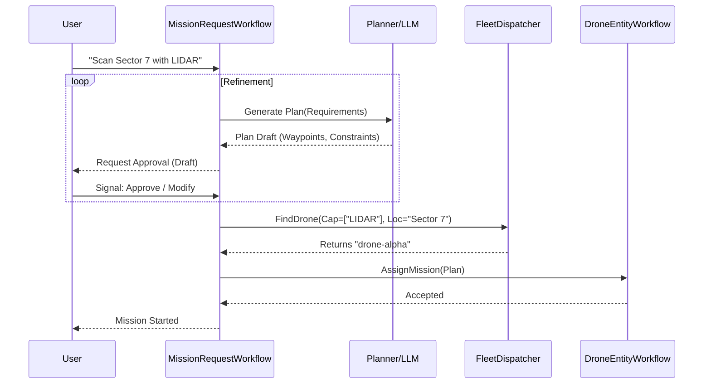

# Mission Planning & Dispatch Architecture

## 1. Overview
This document outlines the design for the **Mission Request Workflow**, a high-level orchestration process responsible for taking a user's intent, converting it into a safe and actionable mission plan, and dispatching it to the most suitable drone in the fleet.

Key design tenets:
*   **Interactive Planning**: The plan generation is not a "black box" but a multi-step negotiation between the System (AI/Planner) and the User.
*   **Capability-Based Dispatch**: Matching is not just on availability, but on specific hardware capabilities (e.g., LIDAR, Thermal Camera) and proximity.

---

## 2. The Mission Request Workflow
The `MissionRequestWorkflow` acts as the "Coordinator" for a new mission. It is distinct from the `DroneEntityWorkflow` (which manages a specific drone).

### 2.1 State Machine High-Level Flow
1.  **Intent Receipt**: Receive natural language or structured request (e.g., "Inspect the north dam for cracks").
2.  **Drafting Phase (Loop)**:
    *   **Analyze Requirement**: Identify necessary sensors (e.g., "High-Res Camera" for cracks) and location.
    *   **Generate Plan**: Create a candidate waypoint list and constraints.
    *   **User Review**: Pause for Human-in-the-Loop signal.
        *   *Signal*: `ApprovePlan` -> Proceed.
        *   *Signal*: `RejectPlan(feedback)` -> Re-plan w/ feedback.
3.  **Resource Allocation (Dispatch)**:
    *   Query the Fleet Index for a drone matching: **Status + Capability + Location**.
4.  **Execution Handoff**:
    *   Send the approved plan to the selected `DroneEntityWorkflow`.
    *   Monitor for acceptance.

---

## 3. Interactive Planning Strategy
The planning activity is non-deterministic from a user perspective (human input required). In Temporal, this is modeled as:

*   **Activity**: `GenerateMissionProposal(request)` -> Returns a `MissionPlanDraft`.
*   **Workflow**: Publishes this draft to a UI/API.
*   **Workflow**: `await workflow.wait_condition(...)` waiting for a User Signal.
    *   This allows the system to hold state indefinitely while waiting for human sign-off.
    *   Safety Checks (e.g., Battery requirements, Airspace restrictions) are run *during* the drafting phase to ensure the user only approves valid plans.

---

## 4. Capability-Based Dispatching
Finding the "right" drone requires filtering on static attributes and dynamic state.

### 4.1 Drone Attributes (Registry)
Each drone in the AWS IoT Registry will have an `attributes` map defining its fixed hardware:
*   `type`: "quadcopter", "fixed-wing"
*   `sensors`: ["camera_4k", "lidar", "thermal"]
*   `max_range_km`: "15"
*   `payload_capacity_kg`: "2.5"

### 4.2 The Query Logic
The `FleetDispatcher` will execute a composite query against the AWS IoT Fleet Index:

```sql
connectivity.connected: true
AND shadow.reported.status: IDLE
AND attributes.sensors: "lidar"  <-- Capability Match
AND attributes.max_range_km >= 10
```

### 4.3 Spatial Selection (Proximity)
*   **Phase 1 (Coarse)**: Filter by Region/ServiceArea attribute (e.g., `attributes.service_area: "Sector-7"`).
*   **Phase 2 (Fine)**: From the candidates returned by Phase 1, compute the Great Circle distance from `shadow.reported.location` to the `mission_location`. Select the closest candidate.

---

## 5. Information Architecture


