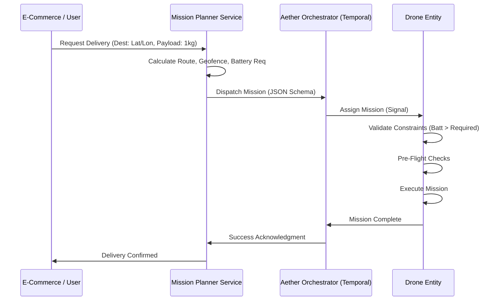

# Mission Safety & Information Flow Protocol

## 1. Overview
This document defines the **Information Flow** and **Safety Protocols** for drone missions in the Aether system. It models the output of a future "Mission Planner Service" and specifies how the Orchestrator enforces safety checks throughout the mission lifecycle.

## 2. Information Flow
The high-level flow from request to execution:



## 3. Mission Data Model
We extend the existing `mission_plan.json` to include **Operational Constraints** and **Lifecycle Requirements**.

### 3.1 Extended Structure
```json
{
  "mission_id": "uuid",
  "priority": "HIGH",
  "constraints": {
    "min_battery_start": 30.0,
    "max_wind_speed": 10.0,
    "max_flight_time_sec": 1200,
    "required_sensors": ["GPS", "LIDAR"]
  },
  "geofence": {
    "polygon": [...],
    "max_altitude": 120.0,
    "action_on_breach": "RTL"
  },
  "route": [
    { "type": "TAKEOFF", "alt": 10 },
    { "type": "WAYPOINT", "lat": -35.1, "lon": 149.1, "speed": 15 },
    { "type": "ACTION", "action": "DROP_PACKAGE" },
    { "type": "LAND" }
  ],
  "emergency_rally_point": { "lat": -35.2, "lon": 149.2, "alt": 30 }
}
```

## 4. Workflow Lifecycle & Checks
The `MissionWorkflow` is responsible for enforcing these stages:

### Phase 1: Pre-Flight Validation (Ground)
*   **Input Validation**: Schema check, Waypoints within Geofence?
*   **System Health**:
    *   Battery Level > `constraints.min_battery_start`
    *   GPS Fix Type >= 3 (3D Fix)
    *   Arming Status: DISARMED initially
*   **Airspace**: Check for Temporary Flight Restrictions (TFRs) [Future].

### Phase 2: Execution & En-Route Monitoring (In-Air)
*   **Continuous Monitoring**:
    *   Battery Estimate: Time Remaining > Distance to Home
    *   Link Quality: RSSI > Threshold
    *   Geofence Breach: Immediate RTL if violated
*   **Waypoint Logic**:
    *   Verify achievement of each waypoint (distance delta < 2m).
    *   Execute associated actions (Payload release).

### Phase 3: Post-Flight (Ground)
*   **Secure**: Disarm motors.
*   **Report**: Upload flight logs to S3.
*   **Status**: Update Shadow to `IDLE`, Battery usage report.

## 5. Implementation Strategy
1.  **Update Schema**: Modify `schemas/mission_plan.json` to add `constraints` object.
2.  **Update Workflow**: Enhance `MissionWorkflow` (in `src/workflows.py`) to execute a `validate_preflight` activity before takeoff.
3.  **Update Activity**: Implement `check_health` activity that queries drone telemetry for Battery/GPS.
